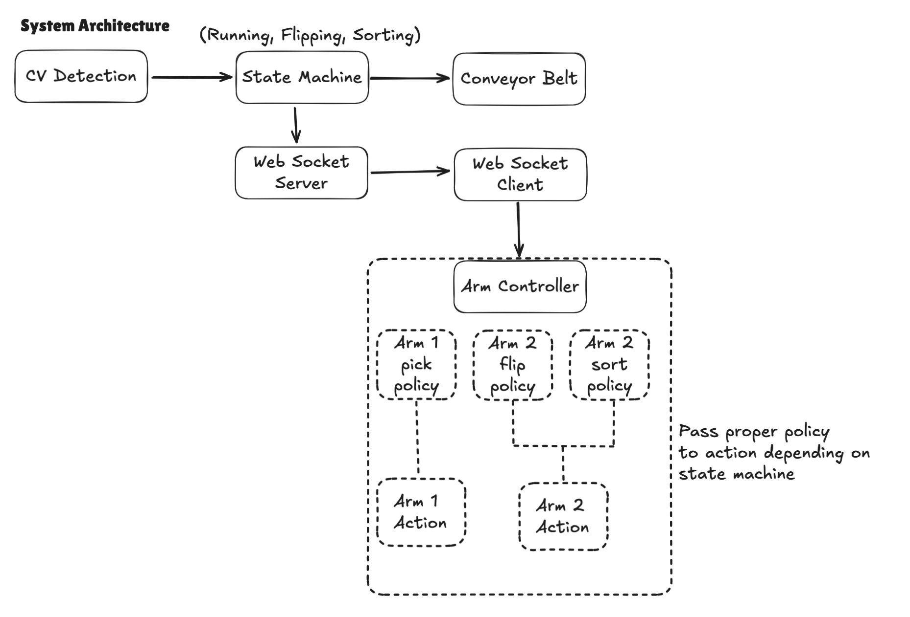

# AMD_Robotics_Hackathon_2025_Flip&Ship

## Team Information

**Team:**

**Team Number:** 6  
**Team Name:** *Inverse Kinema-tricks*  
**Team Members:**
- Xiao Feng
- Giacomo Randazzo
- Nicolas Rodriguez

**Summary:**

We got inspired by recent advances in humanoid robotics, especially that cool Figure robot demo at an Amazon fulfillment center where it was flipping packages to expose barcodes for scanning:


We thought: "Hey, we can do something similar!" So we built our version using more affordable hardware and open-source VLA models, plus a healthy dose of creative engineering! 

## Introducing Our Project: **Flip & Ship!**

### System Overview

We designed and built a compact sorting station inspired by modern fulfillment centers:

**Project schematic:**  


**Real-world setup:**  


### Hardware

- **Robotic Arms:** 2x SO101 units
- **Cameras:** 3 provided by the hackathon organizers
- **Conveyor Belt:**
  - Custom-built using a stepper motor salvaged from a used 3D printer
  - Belt crafted with tape in a perfectly hacky mindset

---

## Submission Details

### 1. Mission Description

Our system can be used in a package delivery center to make sure barcodes are facing the right way (just like that Figure robot demo!). Plus, we can sort packages to send them in the right direction too.

### 2. Creativity

- We're using basic skills that have been shown in hackathons before (pick and place, sorting), but we're combining them in a way that actually solves a real-world problem!
- The "flipping packages" skill has never been demonstrated before to our knowledge.
- Let's be honest, our DIY conveyor belt made from a salvaged 3D printer motor and tape? That's peak hackathon creativity right there!
- Finally, we developed a novel approach for fast policy switching during inference for Arm 2. Inspired by recent developments in [RTC](https://huggingface.co/docs/lerobot/en/rtc), we developed a queuing system where we have 2 threads running policies and pushing to a queue, and 1 thread running inference, choosing what policy to listen to (sorting or flipping) depending on what the computer vision and conveyor belt system tells it. See the Technical Implementation section for more details!

### 3. Technical Implementations

#### Policy Architecture

We developed 3 policies in total:
- **1 policy for Arm 1:** Picks up packages and drops them on the conveyor belt
- **2 policies for Arm 2:** One for sorting packages into the correct color box, and one for flipping packages to expose barcodes

The computer vision system is responsible for selecting the appropriate policy for Arm 2. If it can detect the package color, it instructs Arm 2 to sort the package. If the color (and thus the barcode) is not visible, it instructs Arm 2 to flip the package.

While we believe that both flipping and sorting could eventually be handled by a single unified policy, we segmented them into smaller, simpler policies given our time constraints. This modular approach also provides better control and debugging capabilities.

The computer vision system also controls the conveyor belt. The belt runs continuously and only stops when a package is detected at the end, ready for processing.

#### Architecture

Our system runs on two computers that talk to each other over WebSocket:

**Conveyor Belt Computer:**
- Runs computer vision detection (checks if package is at the end and if barcode is visible)
- Has a state machine that decides what to do: `RUNNING` (picking packages), `FLIPPING` (barcode hidden), or `SORTING` (barcode visible)
- Controls the conveyor belt (starts/stops it based on state)
- Sends state changes to the Arms Computer via WebSocket

**Arms Computer:**
- Receives state commands from the Conveyor Belt Computer via WebSocket
- Has an `ArmController` that maps states to which policies should be active
- Runs 2 threads per arm (4 threads total): one for inference (running the policy) and one for executing actions
- Uses a queuing system inspired by [RTC](https://huggingface.co/docs/lerobot/en/rtc) - the inference thread pushes actions to a queue, and the action thread pulls from it. This architecture enables rapid policy switching (e.g., switching from flip to sort) without stopping the robot, ensuring smooth and continuous operation!

**State Machine Flow:**
- `RUNNING` → `FLIPPING`: Package detected at end, but barcode is hidden
- `RUNNING` → `SORTING`: Package detected at end, barcode is visible
- `FLIPPING` → `SORTING`: After flipping, barcode becomes visible
- `SORTING` → `RUNNING`: Package removed from detection zone



#### Teleoperation / Dataset Capture

We captured 150 episodes for each policy, making sure to have recordings for both daylight and nighttime conditions.

Our datasets can be found here:
- [Arm 1 Pick packages from cardboard](https://huggingface.co/datasets/giacomoran/hackathon_amd_mission2_blue_pick_cardboard)
- [Arm 2 Flip packages](https://huggingface.co/datasets/giacomoran/hackathon_amd_mission2_black_flip)
- [Arm 2 Sort packages](https://huggingface.co/datasets/giacomoran/hackathon_amd_mission2_black_sort)


#### Training

We first trained ACT models for each policy. Training was quite fast on the MI300X GPU (only 50 minutes for 10,000 steps)!


Then we trained SmolVLA models (5 hours for 80,000 steps).


Here are our 3 final trained models:
- [Arm 1 Pick packages from cardboard](https://huggingface.co/giacomoran/hackathon_amd_mission2_blue_pick_act_cardboard_v2) (ACT model)
- [Arm 2 Flip packages](https://huggingface.co/giacomoran/hackathon_amd_mission2_black_flip_smolvla_v3) (SmolVLA)
- [Arm 2 Sort packages](https://huggingface.co/giacomoran/hackathon_amd_mission2_black_sort_smolvla_v3) (SmolVLA)

#### Inference

All policies run on the AMD laptop using the Radeon 890M GPU, with both arms connected and controlled on the same laptop. The system demonstrates real-time performance with smooth policy switching and low-latency inference.

*(Discussion around latency and memory usage to be added)*

### 4. Ease of Use

- Our system is easy to use and fully centralized, handling all arms, conveyor belt, computer vision, and state management in a unified architecture
- Leveraging VLA (Vision-Language-Action) models, we can quickly learn and adapt to new types of packages with minimal retraining

## Additional Links

### Mission 1

- [README](https://github.com/NRdrgz/AMD_Robotics_Hackathon_2025_InverseKinematricks/blob/main/mission1/README.md)
- [Video](https://github.com/NRdrgz/AMD_Robotics_Hackathon_2025_InverseKinematricks/raw/refs/heads/main/mission1/videos/trained_policy_mission_1.mp4)
- [Dataset on HF](https://huggingface.co/datasets/giacomoran/hackathon_amd_mission1)
- [Model on HF](https://huggingface.co/giacomoran/hackathon_amd_mission1)

### Mission 2

*(TODO)*

*For example, you can provide links to:*

- [README](https://github.com/NRdrgz/AMD_Robotics_Hackathon_2025_InverseKinematricks/blob/main/README.md)
- *Link to a video of your robot performing the task*
- *Models on HF*
  - [Arm 1 Pick packages from cardboard](https://huggingface.co/giacomoran/hackathon_amd_mission2_blue_pick_act_cardboard_v2) (ACT model)
  - [Arm 2 Flip packages](https://huggingface.co/giacomoran/hackathon_amd_mission2_black_flip_smolvla_v3) (SmolVLA)
  - [Arm 2 Sort packages](https://huggingface.co/giacomoran/hackathon_amd_mission2_black_sort_smolvla_v3) (SmolVLA)
- *Datasets on HF*
  - [Arm 1 Pick packages from cardboard](https://huggingface.co/datasets/giacomoran/hackathon_amd_mission2_blue_pick_cardboard)
  - [Arm 2 Flip packages](https://huggingface.co/datasets/giacomoran/hackathon_amd_mission2_black_flip)
  - [Arm 2 Sort packages](https://huggingface.co/datasets/giacomoran/hackathon_amd_mission2_black_sort_fixed)

## Code submission

This is the directory tree of this repo, you need to fill in the `mission` directory with your submission details.

```terminal
AMD_Robotics_Hackathon_2025_ProjectTemplate-main/
├── README.md
└── mission
    ├── code
    │   └── <code and script>
    └── wandb
        └── <latest run directory copied from wandb of your training job>
```


The `latest-run` is generated by wandb for your training job. Please copy it into the wandb sub directory of your Hackathon Repo.

The whole dir of `latest-run` will look like below:

```terminal
$ tree outputs/train/smolvla_so101_2cube_30k_steps/wandb/
outputs/train/smolvla_so101_2cube_30k_steps/wandb/
├── debug-internal.log -> run-20251029_063411-tz1cpo59/logs/debug-internal.log
├── debug.log -> run-20251029_063411-tz1cpo59/logs/debug.log
├── latest-run -> run-20251029_063411-tz1cpo59
└── run-20251029_063411-tz1cpo59
    ├── files
    │   ├── config.yaml
    │   ├── output.log
    │   ├── requirements.txt
    │   ├── wandb-metadata.json
    │   └── wandb-summary.json
    ├── logs
    │   ├── debug-core.log -> /dataset/.cache/wandb/logs/core-debug-20251029_063411.log
    │   ├── debug-internal.log
    │   └── debug.log
    ├── run-tz1cpo59.wandb
    └── tmp
        └── code
```

**NOTES**

1. The `latest-run` is the soft link, please make sure to copy the real target directory it linked with all sub dirs and files.
2. Only provide (upload) the wandb of your last success pre-trained model for the Mission.
