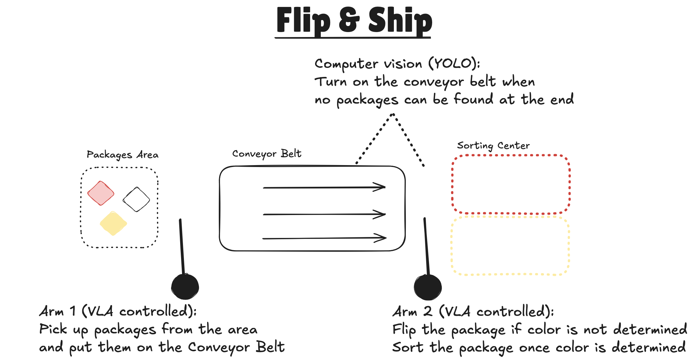
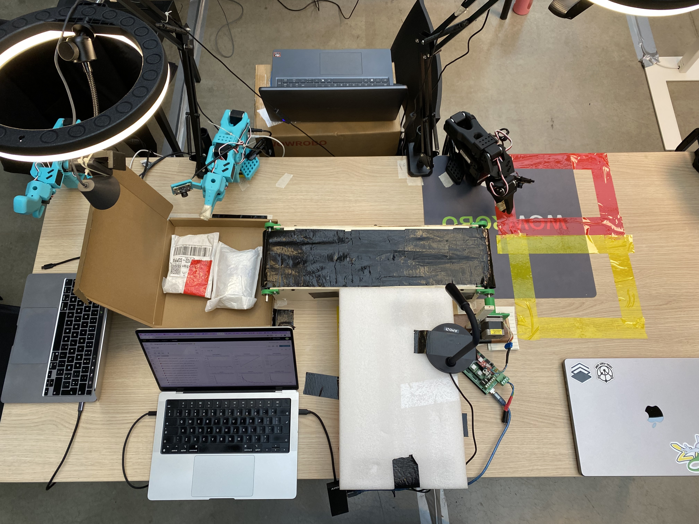
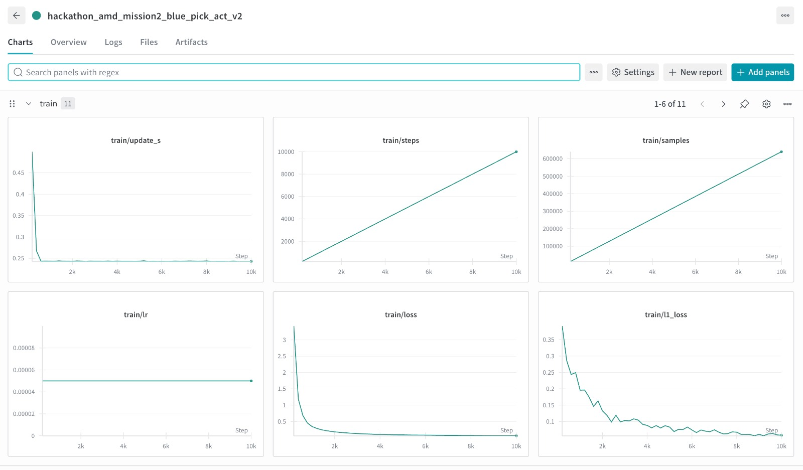
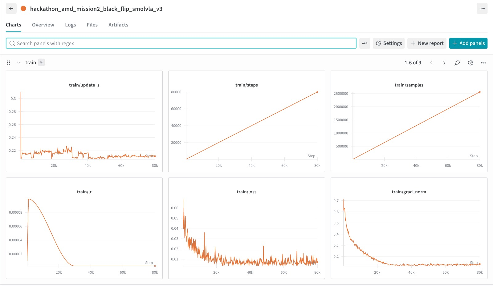

# AMD_Robotics_Hackathon_2025_Flip&Ship

## Team Information

**Team:**

**Team Number:** 6  
**Team Name:** *Inverse Kinema-tricks*  
**Team Members:**
- Xiao Feng
- Giacomo Randazzo
- Nicolas Rodriguez

**Summary:**

We got inspired by recent advances in humanoid robotics, especially that cool Figure robot demo at an Amazon fulfillment center where it was flipping packages to expose barcodes for scanning:


We thought: "Hey, we can do something similar!" So we built our version using more affordable hardware and open-source VLA models, plus a healthy dose of creative engineering! 

## Introducing Our Project: **Flip & Ship!**

### System Overview

We designed and built a compact sorting station inspired by modern fulfillment centers:

**Project schematic:**  


**Real-world setup:**  


### Hardware

- **Robotic Arms:** 2x SO101 units
- **Cameras:** 3 provided by the hackathon organizers
- **Conveyor Belt:**
  - Custom-built using a stepper motor salvaged from a used 3D printer
  - Belt crafted with tape in a perfectly hacky mindset

---

## Submission Details

### 1. Mission Description

Our system can be used in a package delivery center to make sure barcodes are facing the right way (just like that Figure robot demo!). Plus, we can sort packages to send them in the right direction too.

### 2. Creativity


- We're using basic skills that have been shown in hackathons before (pick and place, sorting), but we're combining them in a way that actually solves a real-world problem!
- The "flipping packages" skill has never been demonstrated before to our knowledge.
- And let's be honest, our DIY conveyor belt made from a salvaged 3D printer motor and tape? That's peak hackathon creativity right there!

### 3. Technical Implementations

We've got 3 policies total:
- 1 policy for Arm 1 to pick up packages and drop them on the conveyor belt
- 2 policies for Arm 2: one for sorting packages into the right color box, and one for flipping packages

The computer vision system is responsible for calling the right policy for Arm 2. If it can see the color, it asks Arm 2 to sort the package. If it cannot, it asks Arm 2 to flip the package.

We do believe that both flipping and sorting can eventually be done by a single policy, but we wanted to segment into smaller, simpler policies given our time constraint.

The computer vision also controls the conveyor belt. It's always running and only stops when it detects a package at the end.

#### Teleoperation / Dataset Capture

We captured 150 episodes for each policy, making sure to have recordings for both daylight and nighttime conditions.

Our dataset can be found here:
- [Arm 1 Pick packages from cardboard](https://huggingface.co/datasets/giacomoran/hackathon_amd_mission2_blue_pick_cardboard)
- [Arm 2 Flip packages](https://huggingface.co/datasets/giacomoran/hackathon_amd_mission2_black_flip)
- [Arm 2 Sort packages](https://huggingface.co/datasets/giacomoran/hackathon_amd_mission2_black_sort)


#### Training

We first trained ACT models for each policy. Quite fast on the MI300X GPU (only 50 min for 10,000 steps)!



Then we trained SmolVLA (5 hours for 80,000 steps).



Here are our 3 final trained models:
- [Arm 1 Pick packages from cardboard](https://huggingface.co/giacomoran/hackathon_amd_mission2_blue_pick_act_cardboard_v2) (we kept ACT for this one)
- [Arm 2 Flip packages](https://huggingface.co/giacomoran/hackathon_amd_mission2_black_flip_smolvla_v3) (Smolvla)
- [Arm 2 Sort packages](https://huggingface.co/giacomoran/hackathon_amd_mission2_black_sort_smolvla_v3) (Smolvla)

#### Inference

All policies are running on the AMD laptop using Radeon 890M GPU, with both arms being plugged and controlled on the same laptop.

Here is a fantastic video of our system sorting the package when it first needs to flip it:

*(Video to be added)*

*(Discussion around latency and memory usage to be added)*

### 4. Ease of Use

- *How generalizable is your implementation across tasks or environments?*
- *Flexibility and adaptability of the solution*
- *Types of commands or interfaces needed to control the robot*

## Additional Links

### Mission 1

- [README](https://github.com/NRdrgz/AMD_Robotics_Hackathon_2025_InverseKinematricks/blob/main/mission1/README.md)
- [Video](https://github.com/NRdrgz/AMD_Robotics_Hackathon_2025_InverseKinematricks/raw/refs/heads/main/mission1/videos/trained_policy_mission_1.mp4)
- [Dataset on HF](https://huggingface.co/datasets/giacomoran/hackathon_amd_mission1)
- [Model on HF](https://huggingface.co/giacomoran/hackathon_amd_mission1)

### Mission 2

*(TODO)*

*For example, you can provide links to:*

- *Link to a video of your robot performing the task*
- *URL of your dataset in Hugging Face*
- *URL of your model in Hugging Face*
- *Link to a blog post describing your work*

## Code submission

This is the directory tree of this repo, you need to fill in the `mission` directory with your submission details.

```terminal
AMD_Robotics_Hackathon_2025_ProjectTemplate-main/
├── README.md
└── mission
    ├── code
    │   └── <code and script>
    └── wandb
        └── <latest run directory copied from wandb of your training job>
```


The `latest-run` is generated by wandb for your training job. Please copy it into the wandb sub directory of your Hackathon Repo.

The whole dir of `latest-run` will look like below:

```terminal
$ tree outputs/train/smolvla_so101_2cube_30k_steps/wandb/
outputs/train/smolvla_so101_2cube_30k_steps/wandb/
├── debug-internal.log -> run-20251029_063411-tz1cpo59/logs/debug-internal.log
├── debug.log -> run-20251029_063411-tz1cpo59/logs/debug.log
├── latest-run -> run-20251029_063411-tz1cpo59
└── run-20251029_063411-tz1cpo59
    ├── files
    │   ├── config.yaml
    │   ├── output.log
    │   ├── requirements.txt
    │   ├── wandb-metadata.json
    │   └── wandb-summary.json
    ├── logs
    │   ├── debug-core.log -> /dataset/.cache/wandb/logs/core-debug-20251029_063411.log
    │   ├── debug-internal.log
    │   └── debug.log
    ├── run-tz1cpo59.wandb
    └── tmp
        └── code
```

**NOTES**

1. The `latest-run` is the soft link, please make sure to copy the real target directory it linked with all sub dirs and files.
2. Only provide (upload) the wandb of your last success pre-trained model for the Mission.
